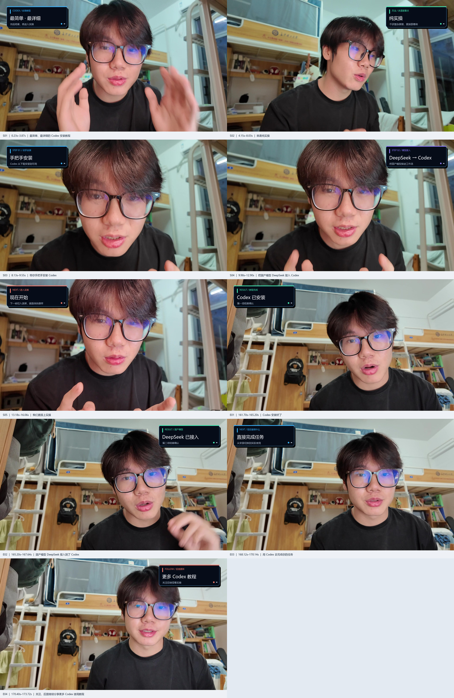
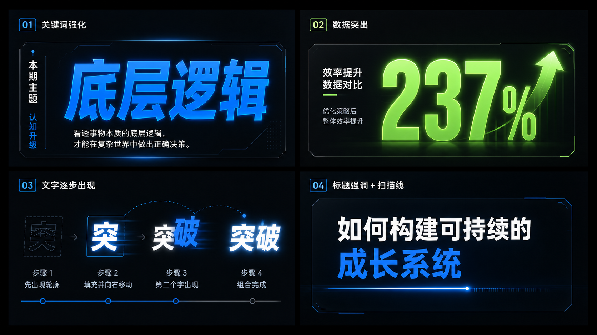

# 工作台教程示例

这是一个“真人开头/结尾 + 中段录屏”的实际剪辑示例。它展示如何从口播语义生成弹窗时间锚点、分镜关键帧和总览图。

## 示例结构

- `timeline/semantic-popup-timeline.csv`：9 个语义卡的起止、触发、退出和口播锚点。
- `timeline/semantic-popup-manifest.json`：不含本机路径的机器可读计划。
- `storyboard/storyboard-overview.jpg`：开头与结尾的分镜总览。
- `storyboard/S01_0.23s.jpg` … `storyboard/E04_170.40s.jpg`：逐卡关键帧。
- `reference-boards/`：通用科技感卡片、评论卡和流程卡参考板。

## 视觉预览

三张通用包装参考板：

## 时间轴摘要

| 区间 | 画面 | 处理 |
| --- | --- | --- |
| 0.23–16.06s | 真人开头 | 5 组语义弹窗，按重音词触发 |
| 16.60–161.40s | 录屏 | 保持原画面，不加弹窗和字幕层 |
| 161.70–173.72s | 真人结尾 | 4 组结果/行动弹窗 |

具体时间以 CSV 为准；不要根据摘要自行四舍五入剪切。

## 使用方法

先读 [根目录 SKILL](../../SKILL.md)，再按 [制作流程](../../docs/workflow.md) 生成自己的时间轴。把示例图当作布局参考：卡片要避开脸、眼睛、嘴部、手势和底部字幕安全区，文字必须先测量再渲染。

## 素材说明

分镜图包含用户本人和拍摄环境，是经用户明确要求上传的示例素材，仅用于展示制作流程、构图和时间关系。仓库不包含源视频、音频、原始转写 JSON、透明中间层或调试帧；请勿据此推断示例人物或背景可用于其他项目。
